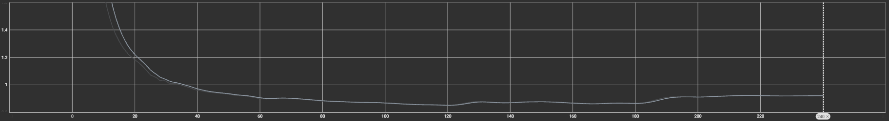
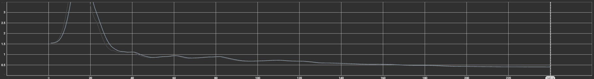
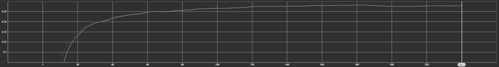
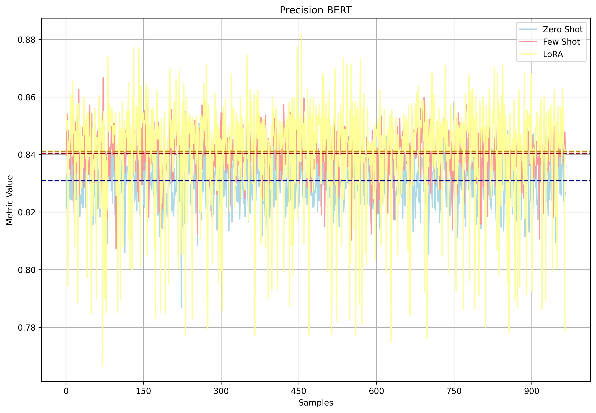
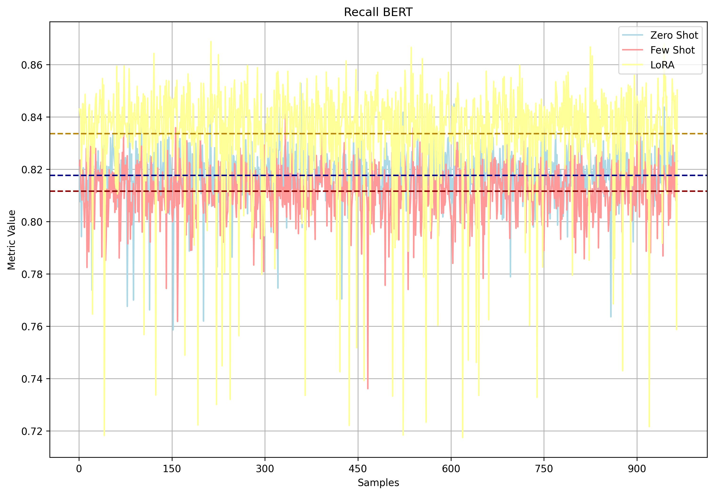
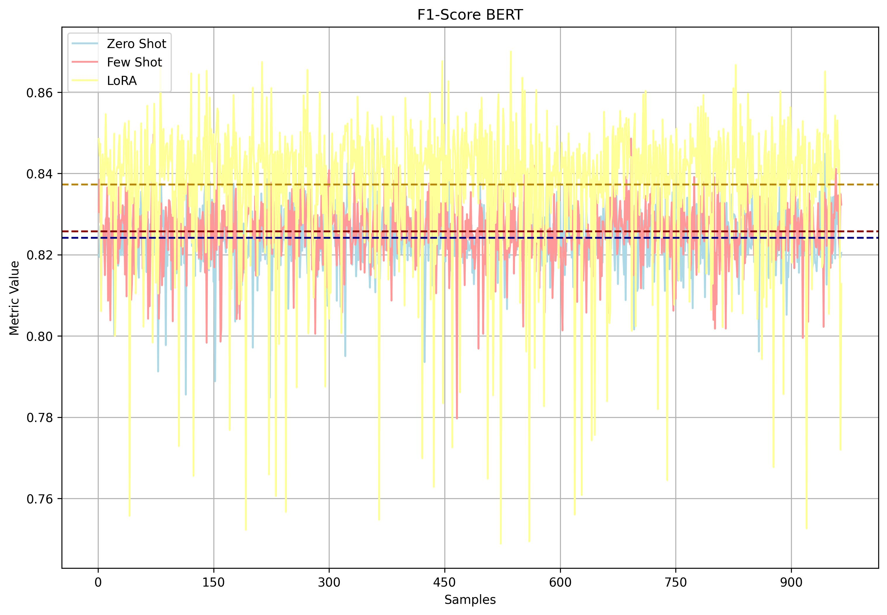
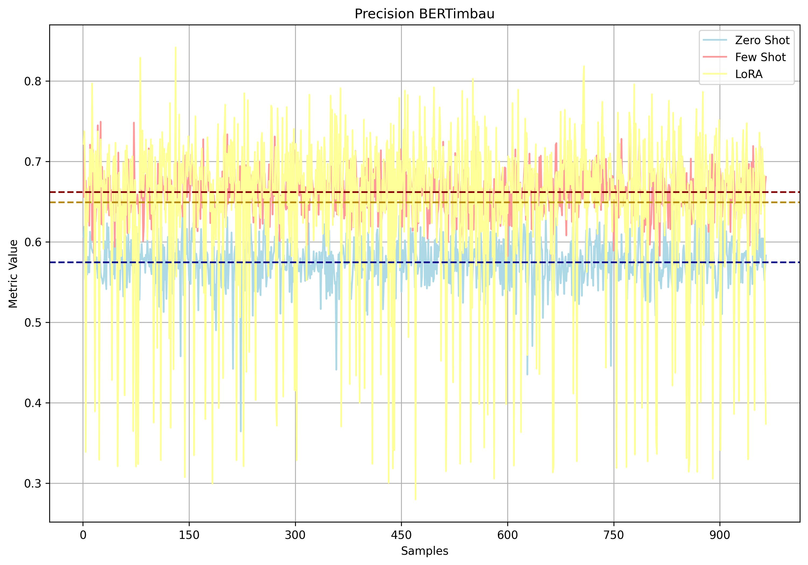
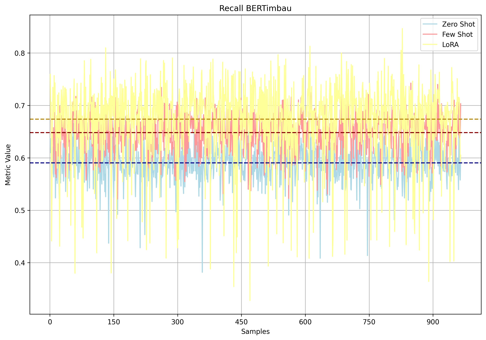
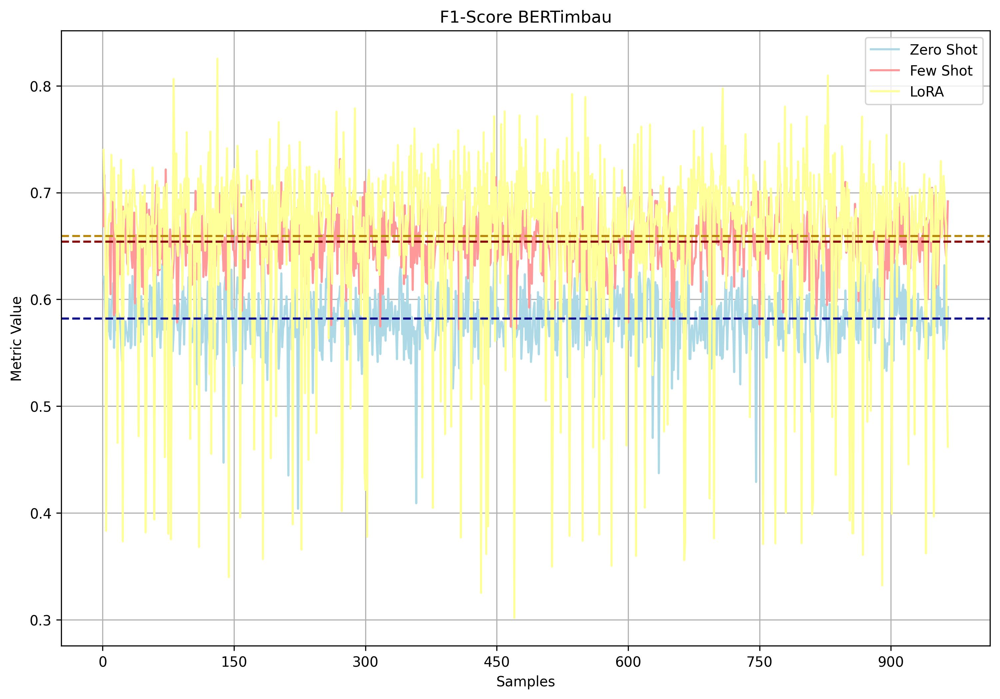

# MIMIC-CXR-PT-BR

This project aims to enhance the MIMIC-CXR dataset by providing **high-quality Portuguese translations** of radiology reports and performing **fine-tuning of MedGemma models** for Portuguese clinical language understanding.

## Overview

The main goals of this project are:

- Translate MIMIC-CXR radiology reports from English to Brazilian Portuguese.
- Fine-tune MedGemma-4B using LoRA to generate Portuguese reports.
- Evaluate the quality of generated reports using **semantic metrics** (BERTScore) with BERTimbau and XLM-RoBERTa.

## Dataset

- **MIMIC-CXR**: 377,110 chest X-ray images with 227,835 radiology reports.
- Only CheXpert labels were used (14 conditions).  
- **Subset for fine-tuning**: 960 training, 473 validation, 965 test studies.  
- Images resized to 896×896 pixels for MedGemma input.

## Models

| Model                        | Purpose                                |
|-------------------------------|----------------------------------------|
| `google/medgemma-27b-text-it` | Translation from EN → PT-BR            |
| `google/medgemma-4b-it`       | Inference & fine-tuning                 |
| BERTimbau Base                | Semantic evaluation (PT-BR reports)   |
| XLM-RoBERTa Large             | Semantic evaluation (EN vs PT-BR)     |

## Fine-Tuning Configuration (LoRA)

### Main Hyperparameters

| Parameter   | Value |
|-------------|-------|
| α (alpha)   | 16    |
| r           | 16    |
| Dropout     | 0.05  |

### Training Settings

- **Batch size:** 1  
- **Gradient accumulation:** 16  
- **Quantization:** 4-bit  
- **Images per sample:** 2 (VRAM constraint)

### LoRA performance

Evaluation Loss Curve

Evaluation Entropy Curve

Evaluation Mean Tokens Accurate Curve

## Evaluation

Two semantic evaluation setups were used:

* Original report (EN) vs. Generated text (PT-BR) – XLM-RoBERTa

* Translated report (PT-BR) vs. Generated text (PT-BR) – BERTimbau

### XLM-RoBERTa

  

    
Evaluation Precision BERT

    
  

  

    
Evaluation Recall BERT

    
  

  

    
Evaluation F1-Score BERT

    
  

### BERTimbau

  

    
Evaluation Precision BERTimbau

    
  

  

    
Evaluation Recall BERTimbau

    
  

  

    
Evaluation F1-Score BERTimbau

    
  

### Summary:

* Few-Shot > Zero-Shot
* LoRA > Few-Shot (on average)
* LoRA shows largest min–max difference, indicating instability

## Authors

- [**Gustavo Freitas Alves**](gprofi98@gmail.com)
- [**Priscila Marques de Oliveira**](pmarquesdeoliveira@gmail.com)